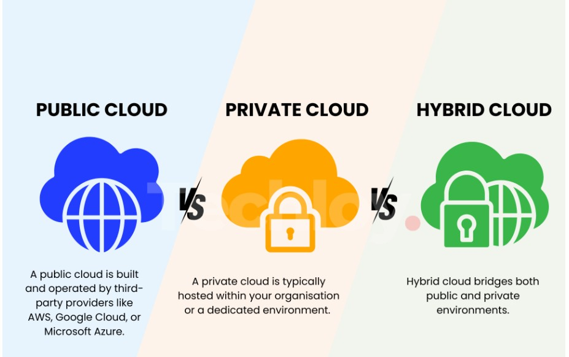
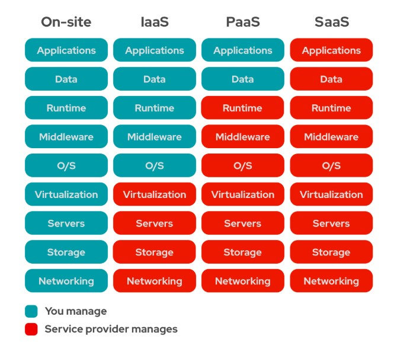

# ☁️ Cloud Computing

## 📖 Overview

Cloud computing is the delivery of computing services such as servers, storage, databases, networking, and software over the internet. Instead of buying and maintaining physical hardware, users can access these resources whenever needed and pay only for what they use.

### Popular Cloud Providers

* Amazon Web Services (AWS)
* Microsoft Azure
* Google Cloud Platform (GCP)

## Why Cloud Computing?

On-premises infrastructure requires businesses to:

* Buy and maintain hardware
* Manage servers and networks
* Hire IT teams
* Pay for power and maintenance
* Upgrade hardware regularly

Cloud computing removes these responsibilities by providing on-demand resources, allowing businesses to focus on developing applications instead of managing infrastructure.

##  Key Characteristics

#### 1. On-Demand Self-Service

Users can create and manage cloud resources whenever needed without contacting the provider.

#### 2. Broad Network Access

Cloud services are available over the internet and can be accessed from:

* 💻 Laptop
* 🖥️ Desktop
* 📱 Mobile
* 📱 Tablet

#### 3. Resource Pooling

Cloud providers share physical resources among multiple customers using a **multi-tenant architecture**.

#### 4. Rapid Elasticity

Resources can automatically scale up or down based on demand.

#### 5. Measured Service

Users are charged only for the resources they use through the **Pay-As-You-Go** pricing model.

## ✅ Advantages

* Lower infrastructure costs
* Pay only for what you use
* Easy to scale resources
* Quick deployment
* High availability
* Automatic updates and maintenance
* Access services from anywhere
* Built-in backup and disaster recovery

## ❌ Disadvantages

* Requires a reliable internet connection
* Data is stored with third-party providers
* Less control over physical infrastructure
* Migrating between providers can be challenging
* Poor resource management can increase costs
* Compliance requirements may limit cloud adoption

# 🌍 Deployment Models

Cloud deployment models define **where** your applications and infrastructure are hosted.

  

## 🌐 Public Cloud

Resources are owned and managed by a cloud provider and shared among multiple customers.

### Examples

* AWS
* Microsoft Azure
* Google Cloud Platform

### Advantages

* No hardware investment
* Highly scalable
* Global availability
* Provider handles maintenance

### Disadvantages

* Limited infrastructure control
* Security and compliance concerns
* Internet dependency

Best For Building startups,Hosting websites and Development and testing

## 🔒 Private Cloud

Infrastructure is dedicated to a single organization, either on-premises or hosted by a provider.

### Advantages

* Better security and privacy
* Greater customization
* Meets strict compliance requirements

### Disadvantages

* Higher setup and maintenance costs
* Requires skilled IT staff
* Limited scalability

Best when:Handling medical records,Banking systems,Government applications 
	
## 🔄 Hybrid Cloud

A combination of private and public cloud environments that allows workloads to move between them.

### Advantages

* Combines security with scalability
* Cost optimization
* Better disaster recovery
* Flexible workload management

### Disadvantages

* Complex architecture
* Integration challenges
* Requires experienced administrators

Best when:Keeping sensitive data private, Using the public cloud for extra capacity

# ☁️ Cloud Service Models

Cloud service models define **who manages which part** of the infrastructure.

  

## 🏗️ Infrastructure as a Service (IaaS)

IaaS gives users virtual computing resources such as servers, storage, and networking over the internet, allowing them to build and run their own applications.

Users are responsible for installing, configuring, and managing the operating system, software, and applications, while the cloud provider manages the underlying infrastructure.

### Examples

* AWS EC2
* Azure Virtual Machines
* Google Compute Engine

### Best For

* Custom applications
* Legacy systems
* DevOps
* Disaster recovery

## 🚀 Platform as a Service (PaaS)

PaaS provides a ready-to-use platform where developers can create, test, and deploy applications without managing the underlying hardware or operating system.

Cloud providers offer built-in tools, services, and APIs that simplify the application development and deployment process.

### Examples

* AWS Elastic Beanstalk
* Azure App Service
* Google App Engine
* Heroku

### Best For

* Web applications
* Mobile applications
* APIs
* Microservices

## 💻 Software as a Service (SaaS)

SaaS delivers fully managed software applications over the internet, eliminating the need for users to install or maintain the software themselves.

Users can access these applications through a web browser or mobile app, while the service provider takes care of updates, security, and maintenance.

### Examples

* Gmail
* Microsoft 365
* Salesforce
* Zoom

### Best For

* Email services
* Collaboration tools
* CRM systems
* Business applications

## 🎯 Key Takeaways

* Cloud computing delivers computing resources over the internet without requiring businesses to own or maintain physical infrastructure.
* The five key characteristics—on-demand access, broad network access, resource pooling, rapid elasticity, and measured service—make cloud computing flexible and scalable.
* **Deployment models** define **where** applications and infrastructure are hosted:

  * **Public Cloud** – Shared infrastructure managed by a cloud provider.
  * **Private Cloud** – Dedicated infrastructure for a single organization.
  * **Hybrid Cloud** – Combines public and private clouds.
* **Service models** define **how responsibilities are shared**:

  * **IaaS** – Users manage the operating system and applications.
  * **PaaS** – Users focus on application development while the provider manages the platform.
  * **SaaS** – Users simply use the software while the provider manages everything.
* Selecting the right deployment and service model depends on business needs, security requirements, scalability, and budget.

